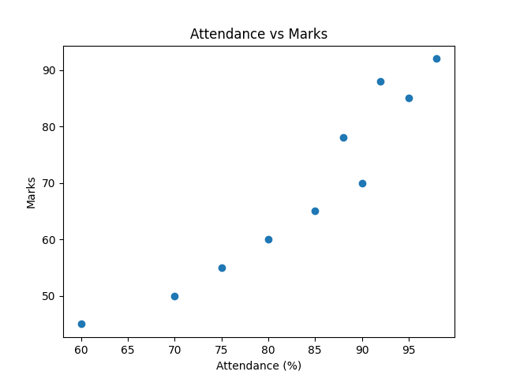
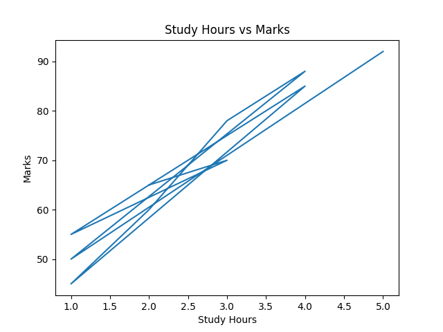
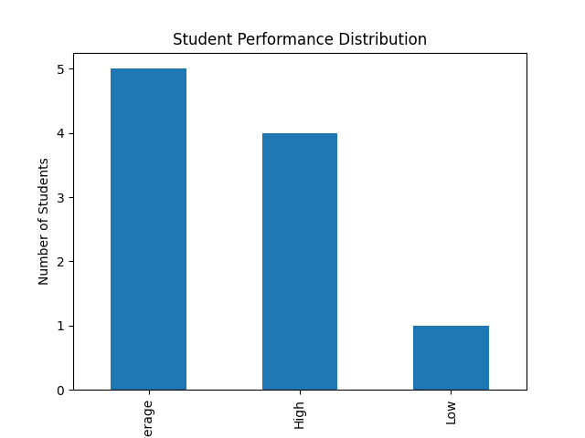

# 🎓 Student Performance Analysis using Big Data


---

## 📌 Project Overview

This project analyzes student performance using **Big Data Analytics techniques**. It processes large volumes of student data such as attendance, study hours, and marks to identify patterns and relationships that influence academic performance.

The system provides insights to help educators identify weak students early and improve teaching strategies using **data-driven decision-making**.

---

## 🎯 Objectives

* Analyze student academic data efficiently
* Identify key factors affecting performance
* Detect weak-performing students
* Visualize performance trends
* Improve overall academic outcomes

---

## 🚀 Features

* 📊 Data preprocessing and cleaning
* 📈 Data visualization using graphs
* 📉 Performance metrics calculation
* ⚠️ Weak student identification
* 🔍 Correlation analysis

---

## 🛠 Technologies Used

* Python
* Pandas
* Matplotlib
* VS Code

---

## 📂 Project Structure

```
Student-Performance-Analysis-Big-Data/
│
├── data/
│   └── student_data.csv
│
├── src/
│   └── analysis.py
│
├── results/
│   ├── attendance_vs_marks.png
│   ├── studyhours_vs_marks.png
│   └── performance_distribution.png
│
├── docs/
│   ├── report.pdf
│   └── ppt.pptx
│
├── README.md
├── requirements.txt
└── .gitignore
```

---

## 📊 Dataset

The dataset includes:

* Attendance (%)
* Study Hours
* Marks

---

## 📈 Results

### 📊 Attendance vs Marks



### 📈 Study Hours vs Marks



### 📉 Performance Distribution



---

## 📌 Performance Metrics

* Average Marks
* Maximum & Minimum Marks
* Standard Deviation
* Correlation between Attendance & Marks
* Performance Categorization

---

## ⚙️ How to Run

### 1. Clone Repository

```
git clone https://github.com/kaushik050/Student-Performance-Analysis-Big-Data.git
cd Student-Performance-Analysis-Big-Data
```

### 2. Install Requirements

```
pip install -r requirements.txt
```

### 3. Run Project

```
cd src
python analysis.py
```

---

## 👨‍💻 Team Members

* Y S KAUSHIK REDDY (2320030050)
* D NITHIN REDDY (2320030430)
* K PRANAY (2320030481)

---

## 📚 References

* Kaggle Dataset
* Python Documentation
* Educational Data Mining Research Papers
* Data Mining: Concepts and Techniques

---

## 🔮 Future Scope

* Add Machine Learning models (Random Forest, etc.)
* Real-time data analysis
* Web dashboard using Streamlit
* Integration with Hadoop & Spark

---

## ⭐ Support

If you found this project useful, give it a ⭐ on GitHub!
